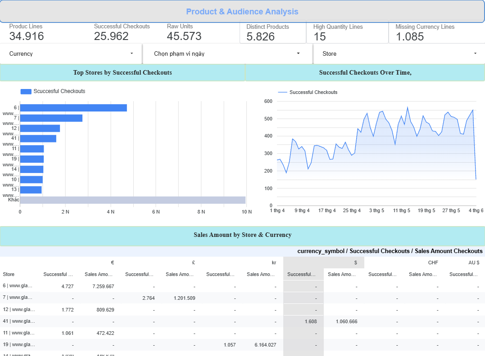
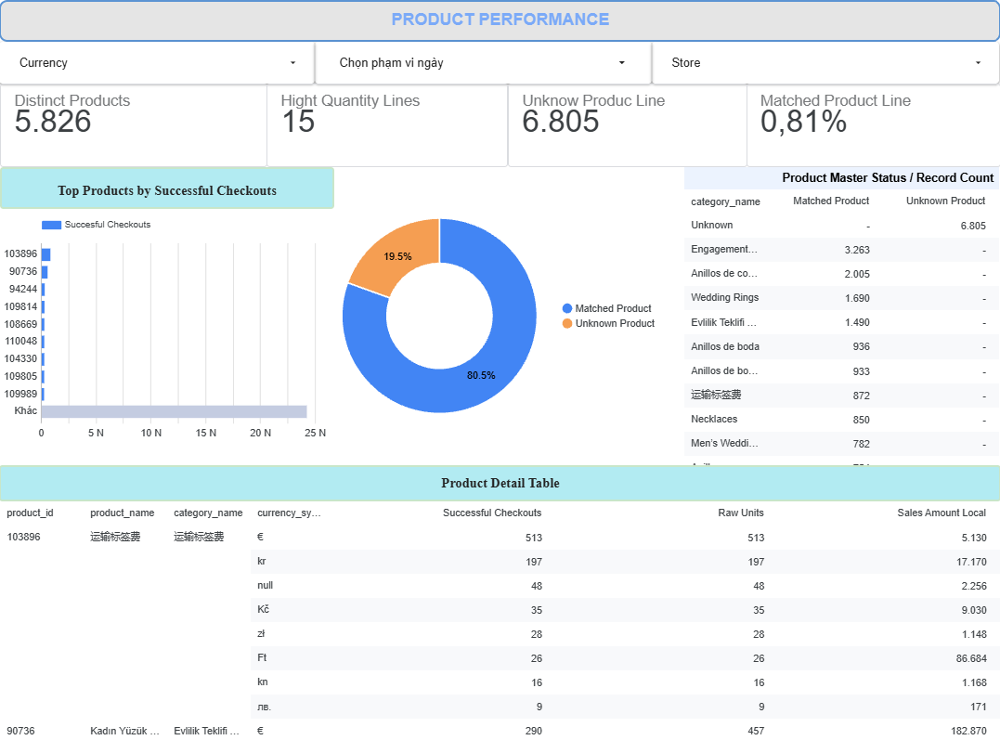
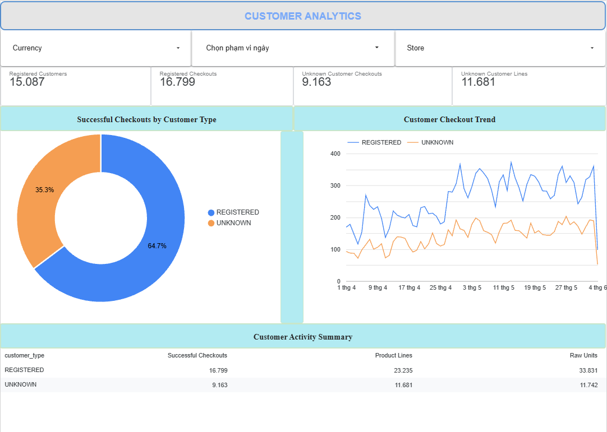
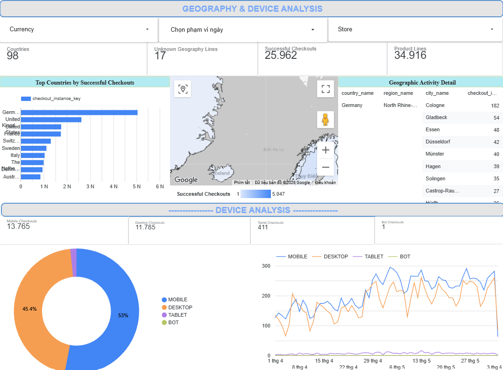

# Glamira BI Dashboard Handoff

Last reviewed: 2026-09-15

## 1. Purpose

The Glamira BI dashboard provides business-facing analysis of successful
checkout activity produced by the dbt dimensional mart.

The dashboard is implemented in Looker Studio and consumes only the
BI-serving dbt view:

`glamira-pipeline-506706.dbt_dev_mart.bi_sales_order_detail`

The dashboard does not query raw, staging, or core datasets directly.

---

## 2. Data flow

The reporting flow is:

Raw BigQuery data
→ dbt staging
→ dbt core
→ dimensional mart
→ `bi_sales_order_detail`
→ Looker Studio

The BI-serving view preserves the grain of:

One product line within one deduplicated successful checkout.

---

## 3. Dashboard pages

### Page 1 — Executive / Sales Overview

Purpose:

Provide a high-level view of successful checkout activity, store performance,
local sales amount, and important data-quality indicators.

Primary KPIs:

- Product Lines
- Successful Checkouts
- Raw Units
- Distinct Products
- High Quantity Lines
- Missing Currency Lines

Visuals:

- Successful Checkouts Over Time
- Top Stores by Successful Checkouts
- Sales Amount by Store & Currency

Controls:

- Currency
- Date Range
- Store

---

### Page 2 — Product Performance

Purpose:

Analyze product activity and product-master coverage.

Primary KPIs:

- Distinct Products
- Unknown Product Lines
- Product Coverage
- High Quantity Lines

Visuals:

- Top Products by Successful Checkouts
- Product Master Coverage
- Product Detail Table

Product identity is based on `product_id`.

`product_name` and `category_name` are enrichment attributes and must not be
used as unique product identifiers.

---

### Page 3 — Customer Analytics

Purpose:

Compare registered and unresolved/anonymous customer activity without
exposing customer-level identifiers.

Primary KPIs:

- Registered Customers
- Registered Checkouts
- Unknown Customer Checkouts
- Unknown Customer Lines

Visuals:

- Successful Checkouts by Customer Type
- Customer Checkout Trend
- Customer Activity Summary

No raw customer identifier or pseudonymized customer hash is exposed in the
dashboard.

---

### Page 4 — Geography & Device Analysis

Purpose:

Analyze successful checkout activity by geography and device class.

Geography KPIs:

- Countries
- Successful Checkouts
- Product Lines
- Unknown Geography Lines

Geography visuals:

- Top Countries by Successful Checkouts
- Successful Checkouts by Country
- Geographic Activity Detail

Device KPIs:

- Mobile Checkouts
- Desktop Checkouts
- Tablet Checkouts
- Bot Checkouts

Device visuals:

- Successful Checkouts by Device Type
- Device Checkout Trend

---

## 4. KPI definitions

### Product Lines

Number of rows in the BI-serving view.

Formula:

`COUNT(*)`

Current baseline:

34,916

### Successful Checkouts

Number of distinct deduplicated checkout instances.

Formula:

`COUNT(DISTINCT checkout_instance_key)`

Current baseline:

25,962

### Raw Units

Total source-faithful product quantity.

Formula:

`SUM(quantity)`

Current baseline:

45,573

Raw Units can be affected by known high-quantity source anomalies.

### Distinct Products

Number of distinct source product identifiers.

Formula:

`COUNT(DISTINCT product_id)`

Current baseline:

5,826

---

## 5. Revenue and currency policy

`line_amount_local` represents monetary value in the local currency associated
with the storefront.

The dataset contains multiple currencies.

Therefore:

- monetary values from different currencies must not be aggregated into one
  global revenue value;
- Sales Amount Local must retain Store + Currency context;
- a global normalized revenue KPI is intentionally unsupported;
- FX-normalized revenue requires a dedicated exchange-rate dataset and
  documented conversion methodology.

Every store with a resolved currency currently maps to one currency symbol.

Three stores currently have unresolved currency values, producing 1,085
fact lines with missing currency.

---

## 6. Product-master coverage

Current product coverage:

- Distinct source products: 5,826
- Matched product IDs: 5,628
- Unknown product IDs: 198
- Matched product lines: 28,111
- Unknown product lines: 6,805
- Unknown product line rate: 19.4896%
- Product coverage: approximately 80.51%

Unknown products remain in analytical results rather than being dropped.

---

## 7. Customer baseline

Current customer metrics:

- Registered customers: 15,087
- Registered checkout lines: 23,235
- Registered successful checkouts: 16,799
- Registered raw units: 33,831

- Unknown customer lines: 11,681
- Unknown customer successful checkouts: 9,163
- Unknown customer raw units: 11,742

Unknown Customer is an accepted business state and is not treated as a
transformation failure.

---

## 8. Geography baseline

Current geographic metrics:

- Countries represented: 98
- Unknown geography lines: 17
- Successful checkouts: 25,962
- Product lines: 34,916

Germany currently has the highest checkout activity with approximately
5,047 successful checkouts.

Geographic rankings should primarily use Successful Checkouts rather than Raw
Units because quantity anomalies can distort unit-based comparisons.

---

## 9. Device baseline

Current successful checkouts by device:

| Device | Successful Checkouts |
|---|---:|
| Mobile | 13,765 |
| Desktop | 11,785 |
| Tablet | 411 |
| Bot | 1 |

Total:

25,962 successful checkouts.

All currently observed high-quantity lines occur in Desktop traffic, but this
is treated as an observed correlation rather than a causal conclusion.

---

## 10. Data-quality indicators

Current dashboard-visible quality indicators:

| Metric | Baseline |
|---|---:|
| High Quantity Lines | 15 |
| Missing Currency Lines | 1,085 |
| Unknown Product Lines | 6,805 |
| Unknown Customer Lines | 11,681 |
| Unknown Geography Lines | 17 |

A known high-quantity example contains a quantity of 9,999.

The record is preserved because no authoritative business rule currently
proves that the value is invalid.

Detailed data-quality rules are documented in:

`docs/data_quality.md`

---

## 11. Semantic rules

The following aggregation rules must be preserved:

| Field | BI aggregation |
|---|---|
| `checkout_instance_key` | COUNT DISTINCT |
| `product_id` | COUNT DISTINCT when calculating distinct products |
| `quantity` | SUM |
| `line_amount_local` | SUM only within consistent currency context |
| `sales_order_detail_key` | Identifier; never SUM |
| dimension surrogate keys | Identifier; never SUM |

All date-range filtering uses:

`checkout_date`

`date_key` is a dimensional surrogate key and must not be used as the
dashboard date field.

---

## 12. Security

Looker Studio must use only:

`bi_sales_order_detail`

The BI-serving view intentionally excludes:

- customer_id
- customer_id_hash
- email_address
- ip_address
- device_id
- user_agent
- current_url
- referrer_url

Customer analytics is aggregate-only.

---

## 13. Final reconciliation

The BI-serving view reconciles to the dbt fact model:

| Metric | Result |
|---|---:|
| Rows | 34,916 |
| Distinct fact keys | 34,916 |
| Successful checkouts | 25,962 |
| Raw units | 45,573 |
| Distinct products | 5,826 |
| Unknown customer lines | 11,681 |
| Unknown product lines | 6,805 |
| Unknown geography lines | 17 |
| High quantity lines | 15 |
| Missing currency lines | 1,085 |

No join fan-out was detected.

---

## 14. Final status

The Glamira BI reporting layer now provides:

- a dbt-controlled BI-serving view;
- four Looker Studio dashboard pages;
- reconciled business KPIs;
- multi-currency-safe sales reporting;
- product-master coverage visibility;
- customer analysis without exposing identifiers;
- geographic and device analysis;
- visible data-quality indicators;
- documented semantic and security contracts.

Status:

**PASS — BI / Looker Studio dashboard completed and reconciled.**

## 15. Dashboard screenshots

### Executive / Sales Overview

### Product Performance

### Customer Analytics

### Geography & Device Analysis

